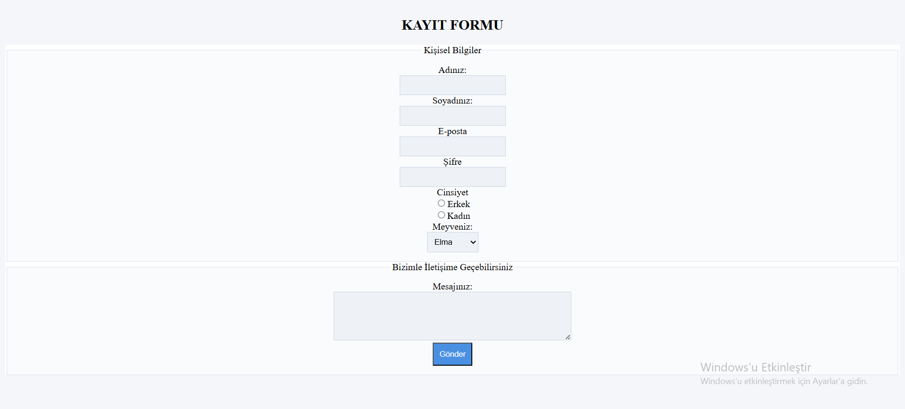

# 📋 Kayıt Formu Projesi

Bu proje, HTML form elemanlarının (input, select, textarea, vb.) kullanımını göstermek amacıyla hazırlanmıştır. Kullanıcıdan bilgi alan ve temel etkileşimli form yapısını içeren basit bir kayıt formudur.

---

## 🧾 Proje Amacı

Aşağıdaki gereksinimleri karşılayan bir HTML formu oluşturulmuştur:

1. Kullanıcının adını ve soyadını girebileceği iki metin kutusu.
2. Kullanıcının e-posta adresini girebileceği bir e-posta alanı.
3. Kullanıcının parolasını girebileceği bir şifre alanı.
4. Kullanıcının cinsiyetini seçebileceği iki radyo butonu (Erkek ve Kadın).
5. Kullanıcının favori meyvesini seçebileceği bir açılır liste (Elma, Muz, Portakal, Çilek).
6. Kullanıcının mesaj yazabileceği bir metin alanı.
7. Tüm bilgileri göndermek için bir "Gönder" butonu.

---

## 💻 Kullanılan Teknolojiler

- HTML5
- Inline CSS (Satır içi stil)
- `<input>`, `<select>`, `<textarea>`, `<fieldset>`, `<legend>` etiketleri

---

## 🖼️ Proje Görseli

Aşağıda formun tarayıcıdaki görünümüne ait bir örnek ekran görüntüsü yer almaktadır:

---

## 🔍 Ek Bilgi

Form elemanları, kullanıcı deneyimini artırmak için sade ve yumuşak renklerle (soft renkler) stillendirilmiştir. Görsel hiyerarşi, okunabilirlik ve kullanım kolaylığı ön planda tutulmuştur.

---

## ✍️ Hazırlayan

Sercan Yalçınkaya  
