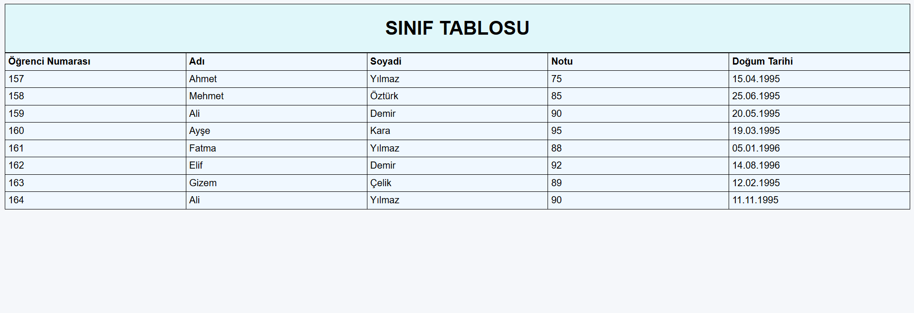

# Sınıf Tablosu (HTML Uygulaması)

Bu proje, HTML kullanılarak oluşturulmuş düzenli bir **sınıf tablosu uygulamasıdır**. Öğrencilerin bilgileri tablo formatında listelenmiş, stil açısından yumuşak ve okunabilir bir görünüm hedeflenmiştir.

---

## 🎯 Proje Görevleri

Bu proje aşağıdaki adımlar izlenerek oluşturulmuştur:

### ✅ 1. HTML Dosyasının Oluşturulması
- Yeni bir HTML dosyası oluşturuldu ve `sinif_tablosu.html` adı verildi.

### ✅ 2. Temel HTML Yapısı
- `<html>`, `<head>`, `<body>`, `<title>` ve `meta` etiketleri ile temel yapı kuruldu.

### ✅ 3. Sayfa Başlığı
- Sayfa başlığı olarak `<h1>SINIF TABLOSU</h1>` ifadesi eklendi.

### ✅ 4. Tablo Başlıkları
- `<table>` elementi ile tablo oluşturuldu.
- `<thead>` satırına aşağıdaki başlıklar eklendi:
  - Öğrenci Numarası
  - Adı
  - Soyadı
  - Notu
  - Doğum Tarihi ✅

### ✅ 5. Öğrenci Bilgileri
- Tabloda toplamda **8 öğrenci** yer aldı.
- Her satırda öğrencinin:
  - Numarası
  - Adı
  - Soyadı
  - Notu
  - Doğum tarihi yer alıyor.

### ✅ 6. Stil Ayarları
- Sayfa arka planı: `#f5f7fa` (soft gri-mavi)
- Başlık kutusu arka planı: `#e0f7fa`
- Tablo genişliği: `%100`
- Hücre içi boşluk: `padding: 5px`
- Tüm hücrelerde `border: 1px solid black`
- Tablo satırları pastel tonlarda renklendirildi (`#f0f8ff`)

---

## 🖼 Görsel Dosyası

- Projeye ait bir ekran görüntüsü eklenmiştir:  
  `assets/sinif_tablosu.png`

Görsel olarak projeyi temsil eder ve ön izlemede kullanılabilir.

---

## 🌐 GitHub Pages ile Yayın

Projeyi çevrimiçi görmek için aşağıdaki bağlantıya tıklayabilirsiniz:

🔗 [Sınıf Tablosu - GitHub Pages](https://github.com/sercanyalcinkaya/Calismalarim/blob/main/sinif_tablosu.html)

---

## 💻 Kullanılan Teknolojiler

- HTML5
- Inline CSS (satır içi stil)
- Visual Studio Code (VS Code)

---

## 📸 Önizleme

