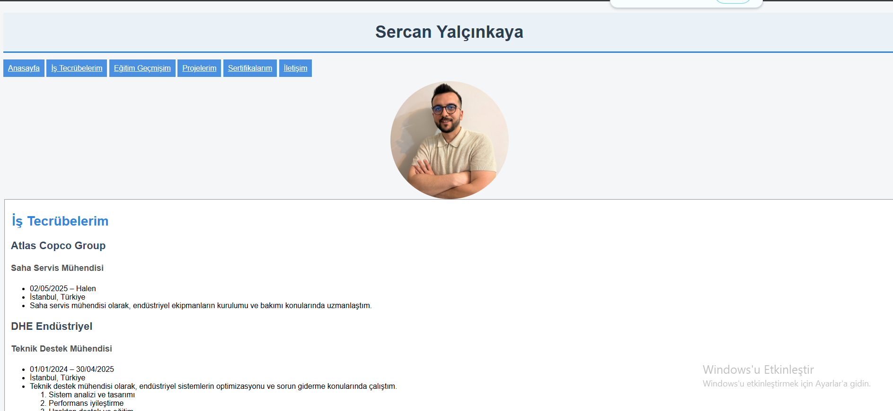

# 🌐 İlk Web Sayfamızı Oluşturmak

Bu proje, HTML5 kullanılarak oluşturulmuş kişisel bir web sayfası örneğidir. Proje, temel HTML etiketleri, stillendirme, listeleme, görseller, iframe kullanımı gibi konuları kapsar.

## 🎯 Proje Amacı

Bu projenin amacı, bir kullanıcının kişisel CV'sini ve geçmişini tanıtabileceği şık ve işlevsel bir web sayfası hazırlamaktır. HTML’in temel yapı taşlarını öğrenmek ve uygulamak hedeflenmiştir.

## 📌 İçerik Özeti

- Sayfa başlığı ve stil tanımları
- Ana başlık ve alt başlıklar (`<h1>`, `<h2>`, `<h3>`)
- Paragraflar (`
`)
- Sıralı ve sırasız listeler (`<ol>`, `<ul>`)
- Görsel kullanımı (``) ve `alt` etiketi
- Farklı bölümlere bağlantılar (`<a href="#..."`)
- Yer haritası için Google Maps iframe entegrasyonu
- Stil (CSS) düzenlemeleri (`background-color`, `font-family`, `color`, `padding`, `border`)
- Düzenli form alanları:
  - E-posta, telefon, adres girişleri
  - Gönder butonu
- Responsive tasarıma uygun yapı

## 📁 Dosyalar

- `odev1WebsiteOlusturma.html`: Ana HTML dosyası
- `odev1.png`: Proje ekran görüntüsü

## 🖼️ Ekran Görüntüsü

Aşağıda projenin ön izlemesine ait bir görsel yer almaktadır:

## 🧩 Kullanılan Etiketler ve Özellikler

- `<html>`, `<head>`, `<body>`
- `<title>`, `<meta charset="UTF-8">`
- `<nav>`, `<header>`, `<fieldset>`, `<legend>`, `<form>`
- `<label>`, `<input>`, `<textarea>`, `<iframe>`
- `<style>` içinde satır içi CSS
- `` görsel yerleştirme
- `<a href="#...">` ile sayfa içi yönlendirme

## 🔗 Proje Bağlantısı

GitHub üzerinden projeye erişmek için:  
👉 [https://github.com/sercanyalcinkaya/Ilk-Web-Sayfamizi-Olusturmak](https://github.com/sercanyalcinkaya/Ilk-Web-Sayfamizi-Olusturmak)
